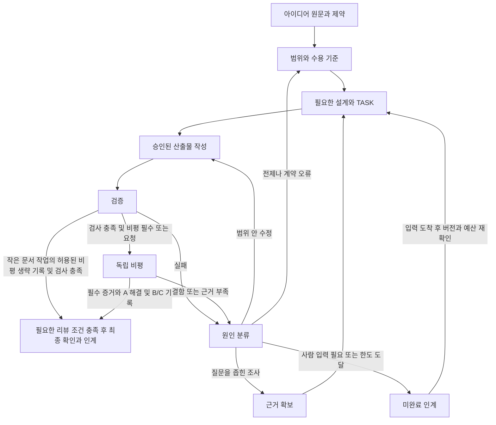

# 하네스 · 루프 · 그래프 운영

이 문서는 여러 단계·세션을 잇는 작업의 운영 계약이다. [공통 규칙](WORKING_RULES.md)의 승인·예산·완료 기준을 따른다. 작은 수정은 TASK의 현재 상태·검사·다음 행동만 적으면 된다. 별도 실행 엔진이나 그래프 라이브러리를 설치하지 않는다.

## 하네스: 실행을 둘러싼 계약

| 요소 | 정본과 책임 |
|---|---|
| 목표·범위·수용 기준 | PROJECT 또는 기존 PRD. 사용자 원문과 승인 근거를 연결 |
| 현재 작업·도구 권한·입출력·예산 | TASK. 담당 세션은 시작 전에 실제 환경과 대조 |
| 실행·관측 | 기존 코드/문서·검사 명령·원문 결과. 생성했다는 설명만으로 통과 불가 |
| 평가·수정 경로 | REVIEW. 작성자와 다른 세션이 판정, 통합 담당이 상태 반영 |
| 재개 | HANDOFF의 다음 행동과 TASK 상태를 실제 파일/버전에 대조 |

세션 시작: 지침과 Git 상태 확인 → 정본·현재 TASK 확인 → 입력 버전/선행/권한 확인 → 가능한 작업 하나 선택.
세션 끝: 산출물·실제 검사·상태·남은 회차·다음 행동 기록. 문서 지시는 권한·예산의 강제 차단 장치가 아니다. 강제 제한은 사용하는 CLI/실행 환경의 기능으로 설정하고 실제 적용 여부를 확인한다.

## 그래프: 작업 의존성과 실행 전이

**작업 의존 그래프**는 TASK의 ID·선행·산출물 버전으로 표현하는 DAG다. 미완료 선행이나 순환 의존성이 있으면 착수하지 않는다. 순환이면 공유 계약을 먼저 정하거나 작업을 합친다. 노드는 역할명이 아니라 검증 가능한 산출물 단위다. 한 세션이 여러 노드를 순차 수행해도 된다.

**실행 그래프**는 현재 상태와 관측 결과에 따라 다음 단계를 고르며, 수정으로 돌아가는 순환을 허용한다. 아래는 여러 워크플로의 공통 경로다. 기획만 요청됐으면 문서 검증·비평·인계에서 끝낸다.

기획·설계의 중요한 가정과 되돌리기 비싼 선택은 구현 전에 비평한다. 실패가 항상 코드 수정으로 향하지 않도록 아래 분기를 적용한다.

| TASK 상태 | 들어가는 조건 | 나가는 조건 |
|---|---|---|
| ready | 선행 완료·입력 버전 일치·수용 기준·권한 확보 | 담당자가 착수하면 running |
| running | 승인 범위의 작업 실행 중 | 필수 검사 충족 후 review; 작은 문서 작업의 허용된 리뷰 생략을 기록하면 최종 확인 후 done; 실패는 원인 분류 |
| review | 검토할 산출물과 증거 고정 | 통과 후 최종 확인하면 done; 수정은 running; 입력 부족은 blocked |
| blocked | 필요한 입력·권한·환경 없음 또는 한도 도달 | 담당·재개 조건을 기록하고, 입력/예산이 실제 확보되면 ready |
| stale | 선행 계약·요구사항·대상 파일이 검토 버전에서 변경됨 | 영향 범위와 새 입력을 대조하고 ready 또는 review로 복귀 |
| done | 요청 범위·필수 증거·리뷰 조건·인계 충족 | 관련 입력 변경 시 영향받는 노드만 stale |

기획·진행 담당 1명이 상태를 갱신한다. 단일 작성자가 이 책임을 겸할 수 있다. 선행 변경은 그 산출물을 소비하는 후속 TASK까지 추적해 재검토한다. 이전 완료 기록은 삭제하지 않고 근거가 어느 버전까지 유효한지 남긴다. 관련 없는 작업은 반복하지 않는다.

## 루프: 비평으로 개선하고 멈추기

수정 한 회차는 **관측 → 원인 분류 → 승인 범위 수정 → 영향 검증 → 필요한 독립 재검토**의 묶음이다. 첫 산출물을 검증/리뷰에 제출하면 TASK에 `0/2`로 시작하고, 반려된 산출물의 수정을 시작할 때 1회 올린다. 제출 뒤 검사 실패와 리뷰 지적은 같은 상한을 쓰되, 한 수정 묶음 안의 개별 검사 호출·실패 횟수를 따로 세지 않는다. 최초 작성 중 탐색·검사에는 회차 대신 TASK 시간/비용 상한을 적용한다. 새 세션·모델·TASK 이름 변경으로 회차를 초기화하지 않는다. 같은 수용 기준의 미해결 문제는 기존 회차를 잇는다.

stale 복귀나 선행 파일 변경만으로도 회차를 초기화하지 않는다. 수용 기준이 실제로 바뀌면 이전 회차·변경 근거·영향을 보존하고, 승인된 새 범위와 예산에 한해 별도 작업으로 집계한다. 같은 실패를 기준 이름만 바꿔 새 작업으로 만들지 않는다. 한도를 다 쓴 기존 작업은 입력이 도착해도 추가 예산이 확보되기 전에는 blocked다.

| 관측 | 돌아갈 곳·행동 | 재개·종료 조건 |
|---|---|---|
| 구현/문서 결함 | 작성자가 원인과 영향 경로를 최소 수정 | 관련 검사와 finding 해결 증거 확인 |
| 문제 정의·가정·계약 오류 | 기획/설계로 돌아가 유지·단순화·대안 중 비교 | 승인 범위 안에서 정본 수정; 목표·범위 변경은 사람 결정 |
| 근거 부족 | 조사 질문 하나·필요 증거 지정 | 원문/재현 확보 후 판정; 자기평가로 대체 금지 |
| 사람 실험·권한·환경 필요 | blocked와 담당·재개 조건 기록 | 실제 입력 전 의존 작업 대기; 독립 작업은 계속 |
| B/C만 남음 | 담당·기한/트리거·유예 사유 기록 | 필수 수용 기준/검사가 충족돼야 다음 작업 진행 |
| 한도 도달 또는 새 근거 없이 같은 실패 반복 | 미완료 인계, 원인 재정의·축소·조사·사람 판단 | 실제 범위/입력/예산 변경 없이 자동 반복 금지 |

수정 효과는 같은 수용 기준에 대한 전후 관측으로 비교한다. 점수 상승·칭찬·모델 다수결은 완료 근거가 아니다. 기준을 바꿔 통과시키지 않는다. 정당한 기준 변경은 사용자 승인 근거와 영향 작업을 기록한다. [리뷰 규칙](../capabilities/review.md)의 A/B/C를 적용하며 미충족 필수 기준은 유예 의견으로 숨기지 않는다.

## 컨텍스트와 재개

구현 재개에는 [HANDOFF](../templates/HANDOFF.md)의 결정 근거·실패한 시도·다음 행동이 필요하다. 독립 비평에는 [REVIEW_PACKET](../templates/REVIEW_PACKET.md)의 문제 입력과 증거 경로를 사용한다. 작성자 대화 요약을 그대로 리뷰 입력으로 쓰지 않는다.

전체 대화를 압축해서 같은 세션을 계속하는 것과, 필요한 상태만 넘겨 새 세션을 시작하는 것은 다르다. 독립 리뷰, 반복 실패로 전제를 재검토할 때, 세션 교체 시에 새 컨텍스트를 사용한다. 정상 진행 중에는 매 단계 리셋하지 않는다. 자동 분리 기능이 없으면 사용자가 새 대화를 열어 패킷을 전달한다. 독립 세션을 확보하지 못하면 자기 점검으로 표시하고 필수 독립 리뷰는 대기로 남긴다.

중단 후에는 HEAD뿐 아니라 staged/unstaged diff와 untracked 대상 파일도 대조한다. 검토 대상은 커밋 ID 또는 파일 목록·내용 해시/저장한 diff로 식별한다. 실행 효과가 불명확한 쓰기 명령은 결과 상태부터 확인하고 재실행한다. HANDOFF는 체크포인트 안내이며 자동 롤백·정확히 한 번 실행을 보장하지 않는다.

## 토큰과 역할 배치

기본은 작성 세션 하나와 필요한 독립 리뷰다. 원문 전체를 매번 복사하지 않고 목표·수용 기준 ID·파일/절·버전·필요 증거만 전달한다. 부족한 근거는 원문을 추가로 읽고, 요약 때문에 요구사항·오류·반대 근거를 누락하지 않는다.

사용 가능한 모델과 사용자 선호를 확인해 경로 탐색·형식 검사 등 경계가 명확한 작업부터 가벼운 모델에 맡길 수 있다. 어려운 설계·반복 실패는 더 적합한 모델로 전환하되 같은 TASK/예산을 잇는다. 모델명은 고정하지 않는다. 호출할 수 없는 모델이나 측정되지 않은 토큰 절감을 사용 실적으로 기록하지 않는다. 같은 작성자의 대화를 상속한 하위 에이전트는 독립 리뷰로 세지 않는다.
